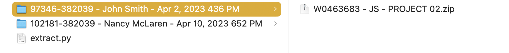
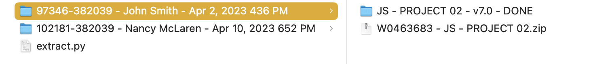

# Brightspace Project Extractor

## The Problem
When multiple students submit a project to Brightspace, the projects files are downloaded in batch as a giant zip file. This file is unzipped into a set of folders - one for each student containing their submitted project files. But what happens if the student zips up their project files and submits that? You end up with a zip file inside each student's folder. The instructor then has to go and manually unzip each zip file in each student's folder. What a mess.

This python script automates this by going into each student's folder and unzipping the project files

## Usage
Copy the extract.py file into the folder containing the student folders:

> 

Then run the script using the following command in the terminal:

```
python extract.py
``` 

The script will go through all folders in the directory and unzip any zip files it finds within them:

> 

## Requirements
- Python 3.6 or higher

## Options
The script has the following options:
- by default the python script will search the current folder for student folders and unzip any zip files it finds within them. You can adjust this with the -path option. For example, if you want to search the folder "student_projects" for student folders, you would use the following command:
``` 
python extract.py -path student_projects
``` 
  
- by default the script will not delete the zip files after unzipping them. You can adjust this with the -delete option. For example, if you want to delete the zip files after unzipping them, you would use the following command:
```
python extract.py -delete
```
  
- automatically run an "npm install" on each project folder once unzipper (Requires Node.js installation). Command:
```
python extract.py -npm
```